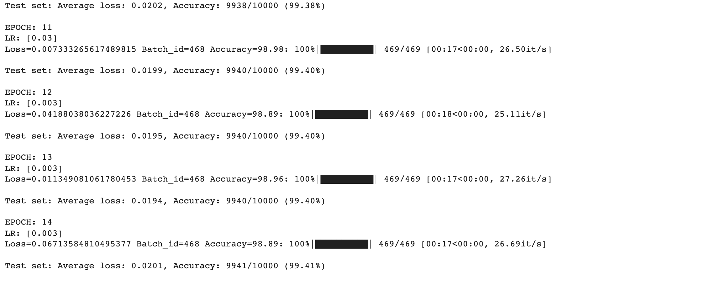
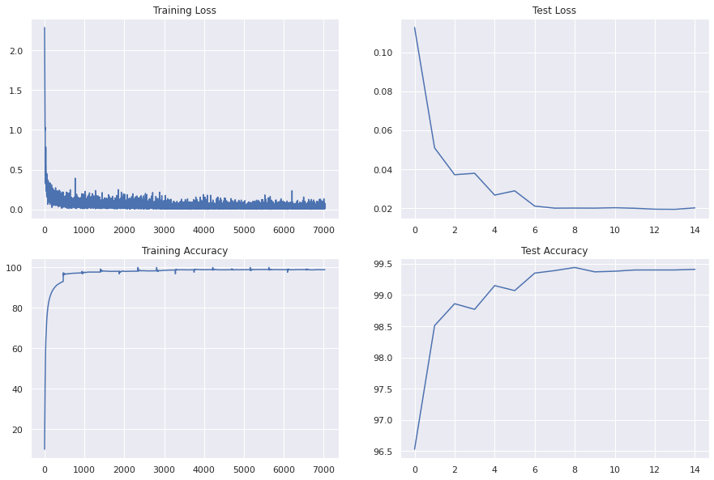

As per the assignmnet there are 3 incrementa steps that have been taken to reach to the target of 99.4% accuracy in <15epoch

## Solution 1
[CodingDrill_S1.ipynb](https://github.com/TSAI-EVA8/CodingDrill/blob/master/code/CodingDrill_S1.ipynb)

### Target

1. Get the setup correct
2. No Transformations
3. Get a pretty decent accuracy, don't worry about <=10K params right now
4. Get the baseline model
5. The training epochs are 15

### Result
1. Params: 13,808
2. Best Train Accuracy: 99.15%
3. Best Test Accuracy : 99.42% in 14th epoch

### Analysis
* The model is not overfitting, but we need to reduce the number of params, since our target is 10K Params
* The model is able to achieve the target but it is not stable. 

## Solution2
[CodingDrill_S2.ipynb](https://github.com/TSAI-EVA8/CodingDrill/blob/master/code/CodingDrill_S2.ipynb)

### Target

1. Need to fix the parameters
2. Apply Image transformations  to make the training hard so that the model can perform better at the test time

### Result
1. Params: 9,910
2. Best Train Accuracy: 99.22%
3. Best Test Accuracy : 99.35%

### Analysis
* The model is not overfitting
* The test accuracy has lot of fluctuation. 
* The training is not seeing lot of improvements and is stuck in 98.6-98.7 range. This indicates may be we need to play with LR

## Solution3
[CodingDrill_S3.ipynb](https://github.com/TSAI-EVA8/CodingDrill/blob/master/code/CodingDrill_S3.ipynb)

### Target

1. Fix the Learning Rate to get the higher accuracy

### Result
1. Params: 9,910
2. Best Train Accuracy: 98.96%
3. Best Test Accuracy : 99.44% in 9th epoch but then reduced to 99.40% from epoch 12 onwards

### Analysis
* The model is underfitting. This is because the training is very hard . there is a rotation of images and the number of parameters is very less

* The real improvement is the use of Scheduler with StepLR. This will start a high Leraning rate so that the model starts learning fast and then drops the LR to smaller rates making the fine adjustments. This is seen in the last epochs where the training accuracy is not changing much.
* The test accuracy is stable

### Final Result

Following as the logs for the last few epochs

The plots show the stable test accuracy

